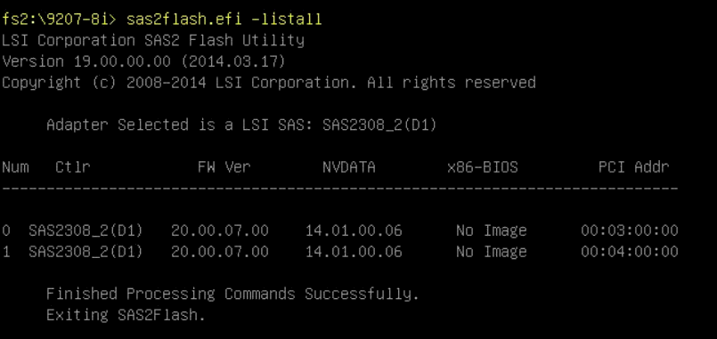

# lab-utils
various utilities and scripts to deploy, configure, and manage lab resources:

## KEYS ##
Supermicro BIOS:
```shell
<DEL> Enter Bios Setup
<F11> Boot Menu
```


## Components ##
### storage array ###

1. LSI SAS9207-8i: https://docs.broadcom.com/docs/12350493
copy:
Firmware/HBA_9207_8i_IT/9207-8.bin  -> firmware/lsi/
sas2flash_dos_rel/sas2flsh.exe      -> firmware/lsi/
sasbios_rel/*                       -> firmware/lsi/
mptsas2.rom                         -> firmware/lsi/

```shell
sas2flash.efi -listall                                ## list cards
sas2flash.efi -c 0                                    ## select card 0
sas2flash.efi -c 0 -o -e 6                                 ## erase the rom of card 0 - do this to also remove the bootloader rom
sas2flash.efi -c 0 -o -f 9207-8.bin                        ## flash selected card with firmware, without adding the boot rom. (faster startup)
sas2flash.efi -o -f 9207-8.bin -b mptsas2.rom         ## flash selected card with firmware adding the boot rom.


sas2flash.efi -o -fwall 9207-8.bin                    ## flash all cards with firmware, without adding the boot rom. (faster startup)
sas2flash.efi -o -f 9207-8.bin -biosall mptsas2.rom   ## flash all cards with firmware adding the boot rom.
```



2. SM x10-srl-f https://www.supermicro.com/en/products/motherboard/X10SRL-F
note: must be done in legacy bios mode. bifercate on port 1 - pcie slot 2/3
copy:
- Extract downloaded zip file       -> firmware/sm/x10-srl-f/
- boot to DOS
```shell
FLASH.BAT X10SRL1.609
```

